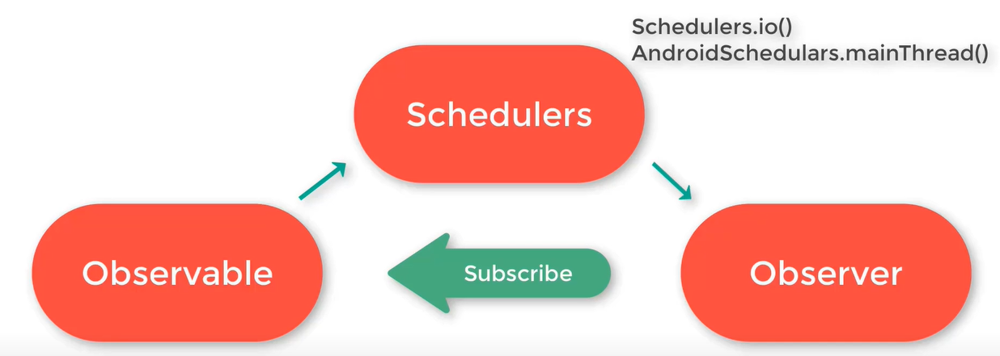
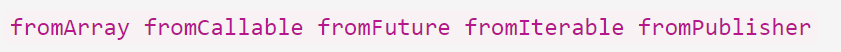
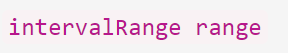
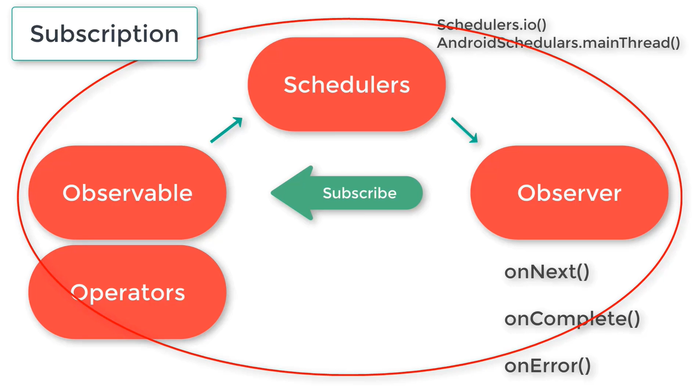

### RX Demo

<a href="https://github.com/ReactiveX/RxJava">RxJava</a> is a JVM based library that helps in composing asynchronous and
event-based programs using observable sequences.

This repository is my template app for implementing RX java in an Android app.

----------------------------------

In <a href="https://en.wikipedia.org/wiki/Reactive_programming">Reactive programming</a> the consumer code blocks react
to the data as it comes in. <a href="https://reactivex.io/">ReactiveX</a> is a project which provides implementations
for this reactive programming concept in different programming languages and various platforms. All implementations of
ReactiveX libraries provide these patterns of reactive programming paradigm 👇👇


**<a href="https://github.com/ReactiveX/Rxandroid">RxAndroid</a>** is just a layer on top
of **<a href="https://github.com/ReactiveX/RxJava">RxJava</a> which provides Android specific support.** For example, it
provides a "scheduler". RxAndroid can't replace RxJava, so we need to use both of them in our Android apps.

----------------------------------

### Observer Pattern


**Observables** are instances
of <a href="http://reactivex.io/RxJava/3.x/javadoc/io/reactivex/rxjava3/core/Observable.html">
Observable</a> class and can emit data. You can sometimes get datastreams directly in the form of observables. For
example, when you're using Retrofit, you can ask your result to be an Observable object. You can also write some code to
convert an existing data stream into an Observable object.<br/><br/> **Observers** are classes that implement
the <a href="http://reactivex.io/RxJava/3.x/javadoc/io/reactivex/rxjava3/core/Observer.html">Observer</a> interface; and
they can consume data emitted by observables.<br/>
One Observable can have so many Observers. When an Observable emits data, that means there's at least one Observer which
is subscribed to that Observable. If there are not any subscribers, no data can be emitted.

----------------------------------


An Observer has 3 main methods:

1- onNext():
<br/>when an observable emits data, it firstly calls to the onNext() method of the Observers that have subscribed to it.

2- onComplete():
<br/>After finishing the data emission, Observable will call the onComplete() method of the Observer.

3- onError():
<br/>If any errors occurred in this operation, Observable will call the onError() method of the Observer. This way, with
the help of RxJava, we don't have to put try/catch block all over our code, all the errors will be handled in onError()
method.

There's also another function in some cases of Observers 👇👇

4- OnSubscribe():
<br/>This function gets called when Observable subscribes to the Observable.


----------------------------------



Between an Observable and Observer, we can
have <a href="http://reactivex.io/RxJava/3.x/javadoc/io/reactivex/rxjava3/core/Scheduler.html">Schedulers</a> which help
us to handle multithreading in a nice way. Scheduler decides whether a particular part of code should run on the
MainThread or on a separate one. There are numerous schedulers available in RxJava but **Schedulers.io()** and
**AndroidSchedulers.mainThread()** are the most common schedulers used in Android world.

----------------------------------


Operators allow you to convert data streams before they're received by the observers; you can chain multiple Operators
together. There are so many operators available in RxJava.

### Map Operators:

<ol>
<li><a href="https://reactivex.io/documentation/operators/map.html">Map</a></li>
<li><a href="https://reactivex.io/documentation/operators/flatmap.html">FlatMap</a></li>
<li>SwitchMap</li>
</ol>

Another group of operators is:

<ol>
<li><a href="https://reactivex.io/documentation/operators/from.html">From</a></li>
These are various version of "From" operator which are available in RxJava 👇👇

The most commonly used of these operators is "fromArray". As a simple example of using it, have a look at the code below, it's a simple Activity in an Android app:

```
package ca.sudbury.hojat.rxdemo

import android.os.Bundle
import android.util.Log
import androidx.appcompat.app.AppCompatActivity
import io.reactivex.rxjava3.android.schedulers.AndroidSchedulers
import io.reactivex.rxjava3.core.Observable
import io.reactivex.rxjava3.disposables.CompositeDisposable
import io.reactivex.rxjava3.observers.DisposableObserver
import io.reactivex.rxjava3.schedulers.Schedulers

class MainActivity : AppCompatActivity() {

    private val TAG = "RxJavaDemo"
    private val greetings = arrayListOf("Hello A", "Hello B", "Hello C")
    private lateinit var myObservable: Observable<String>
    private lateinit var myObserver: DisposableObserver<String>
    private val compositeDisposable = CompositeDisposable()

    override fun onCreate(savedInstanceState: Bundle?) {
        super.onCreate(savedInstanceState)
        setContentView(R.layout.activity_main)

        myObservable = Observable.fromArray(greetings) // fromArray operator 
        compositeDisposable.add(
            myObservable
                .subscribeOn(Schedulers.io())
                .observeOn(AndroidSchedulers.mainThread())
                .subscribeWith(getObserver())
        )
    }

    fun getObserver(): DisposableObserver<String> {

        myObserver = object : DisposableObserver<String>() {
            override fun onNext(t: ArrayList<String>) {
                Log.i(TAG, "onNext() function was invoked - $t")
            }

            override fun onError(e: Throwable) {
                Log.i(TAG, "onError() function was invoked")
            }

            override fun onComplete() {
                Log.i(TAG, "onComplete() function was invoked")
            }
        }

        return myObserver
    }
}
```

<li><a href="https://reactivex.io/documentation/operators/just.html">Just</a></li>
This operator "just" emits the same values provided to it in its arguments. It simply creates an Observable which emits the item given to this operator.<br/><br/>For example, if you give an array of items to a "just" operator, the whole iterable will be emitted as a single item (it won't emit each single item of the iterable independently).
<li><a href="https://reactivex.io/documentation/operators/range.html">Range</a></li>
As the name suggests, this operator creates an Observable which emits a particular range of integers. These are the current "Range" operators we have in RxJava 👇👇<br/>



</ol>
we also have: 

<ol>
<li><a href="https://reactivex.io/documentation/operators/debounce.html">Debounce</a></li>
<li><a href="https://reactivex.io/documentation/operators/buffer.html">Buffer</a></li>
</ol>

----------------------------------

There are numerous variables of observer pattern with specific Observable and Observer objects; for example:


----------------------------------


<br/><a href="http://reactivex.io/RxJava/javadoc/io/reactivex/disposables/Disposable.html">Disposable</a> interface and <a href="http://reactivex.io/RxJava/javadoc/io/reactivex/disposables/CompositeDisposable.html">CompositeDisposable</a> class can be used to avoid memory leaks in reactive programming paradigm.

----------------------------------



Each set of Observable and Observer connection is called a **Subscription**.
A <a href="http://reactivex.io/RxJava/javadoc/rx/Subscription.html">subscription</a> is an interface in this library and
can be viewed as a well managed data stream in our app.

----------------------------------

### Dependencies

In order to use RxJava and RxAndroid in your Android app, you need to add these dependencies to your build.gradle
scripts (If the latest versions are different from what comes here, the IDE itself will ask you to update the versions):

```
    // RxJava:
    implementation "io.reactivex.rxjava3:rxjava:3.1.4"
    // RxAndroid:
    implementation 'io.reactivex.rxjava3:rxandroid:3.0.0'
```

----------------------------------

### Concurrency and multithreading with Schedulers

One of the best advantages of Rxjava is its ability to easily schedule works and process result on various threads which
allows us to heavily optimize system performance

**Scheduler:**
RxJava solution for handling multithreading. You can imagine a Scheduler as a thread pool which manages one or more
threads.<br/> Whenever a Scheduler needs to execute a task, it will take out a thread from its pool and run the task on
that thread.

There are various types of Schedulers available in RxJava.
<ol>
<li>Schedulers.io()</li>
This scheduler can have a limitless thread pool. It's best suited for non CPU intensive tasks; such as database interactions, network communications, and local file system interactions.
<li>AndroidSchedulers.mainThread()</li>
The main thread for all the UI interactions in Android and where all the user interactions happen. Remember that this scheduler is provided by RxAndroid and not RxJava.
</ol>

**In the Android world, 90% of times we only use the 2 schedulers above.**

These are Some other Schedulers you have access to in RxJava:
<ol>
<li><b>Schedulers.newThread()</b></li>
This Scheduler creates a new thread for each unit of the work that has been scheduled. 
<li><b>Schedulers.single()</b></li>
This Scheduler has only a single thread which executes tasks one after another according to their order. 
<li><b>Schedulers.trampoline()</b></li>
This Scheduler executes all the given tasks in a first in first out (FIFO) fashion. This scheduler fits well for implementing recurring tasks. 
<li>Schedulers.from(Executor executor)</li>
This function creates and returns a customized Scheduler backed by a specific <a href="https://developer.android.com/reference/java/util/concurrent/Executor">executor</a>.
</ol>

----------------------------------

### How to use Schedulers in a given Android project via Rx libraries?

RxJava has provided a simple way for scheduling work on a desired thread using 2 methods:
<ol>
<li>observeOn()</li>
<li>subscribeOn()</li>
</ol>

----------------------------------

### Disposable & CompositeDisposable:

Imagine in an Android app that you have created, you're performing the network call to a REST API and then update the
view according to the data you receive from this network call (and you perform all this scenario with an observer
pattern via RxJava).

But in this scenario, if a user initiates a view and decides to go back before the completion of the network call, in
this case, the Activity or Fragment will be destroyed but the "Observer Subscription" will resume working and will even
try to update a UI which is already destroyed. This results in a memory leak and subsequent app crashes.

In order to avoid such situations, we can use "Disposables" to dispose a subscription when the Observer no longer wants
to listen to the Observable.

### Disposable Observer:

For normal Observers we use the Interface "Observer<T>" but for custom Observers we can also use a class
named "<a href="http://reactivex.io/RxJava/3.x/javadoc/io/reactivex/rxjava3/observers/DisposableObserver.html">
DisposableObserver<T></a>".

### Composite Disposable:

In RxJava, one Observable can have so many Observers; you can also have numerous observers in one class. In such
situations, you will have so many observers and remembering to dispose all of them will be a tedious job and might cause
some errors. The easiest way of handling numerous observers and their disposal in RxJava is to use
the <a href="http://reactivex.io/RxJava/javadoc/io/reactivex/disposables/CompositeDisposable.html">
CompositeDisposable</a> class.

----------------------------------

### Suggestions for concise and efficient coding in RxJava:

<ul>
<li><b>Rather than writing different code lines for each one of Schedulers, you can just subscribe and add the Observer to the disposables.</b></li><br/>
For Example, imagine that you want to add a few Schedulers to an Observable and then subscribe an Observer to that Observable; and finally add that whole structure to a disposable, so you can dispose it in future.<br/>
A naive way of doing that is this:

```
// Registering the Schedulers:
myObservable.subscribeOn(Schedulers.io())
myObservable.observeOn(AndroidSchedulers.mainThread())

// Subscribing Observer to Observable
myObservable.subscribe(myObserver)

// making sure the observer will be disposed later on
compositeDisposable.add(myObserver)
```

Instead of doing the verbose and long option above, you can do all of those operations in just one line of code:

```
 compositeDisposable.add(
            myObservable
                .subscribeOn(Schedulers.io())
                .observeOn(AndroidSchedulers.mainThread())
                .subscribeWith(myObserver)
        )
```

</ul>

----------------------------------

### Further reading:

In creating this project I have used these resources:
<ol>
<li><a href="https://www.amazon.ca/Reactive-Programming-RxJava-Asynchronous-Applications/dp/1491931655">Reactive Programming with RxJava by Tomasz Nurkiewicz & Ben Christensen Foreword by Erik Meijer</a></li>
<li><a href="https://youtu.be/Y9fA80V25co">RxJava Android Tutorial by AppDevNotes</a></li>
<li></li>
</ol>